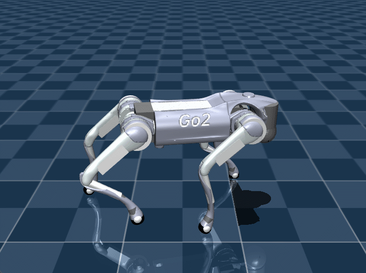

# sim2sim (deploy on mujoco)
代码参考宇树的 [unitreerobotics/unitree_rl_gym](https://github.com/unitreerobotics/unitree_rl_gym)，实现基于 isaaclab 训练的宇树 Go2 强化学习策略模型在 Mujoco 仿真环境下的部署

模型 go2.xml 资源来自 [unitreerobotics/unitree_rl_gym](https://github.com/unitreerobotics/unitree_rl_gym) 中 go2.urdf 文件的转换（可能存在问题），assets 文件来自 [unitreerobotics/unitree_mujoco](https://github.com/unitreerobotics/unitree_mujoco)
## ⚙️ 安装
在你的 Python 环境（建议使用miniconda建立虚拟环境）下额外安装 Mujoco
```bash
pip install mujoco
```
## 🎉 运行
在项目根目录下运行
```bash
python deploy/deploy_mujoco/velocity/deploy_go2.py go2.yaml
```
➡️ 在 `deploy/pretrain/*.pt` 下替换策略模型，修改 `deploy/deploy_mujoco/{TASK}/configs/go2.yaml` 文件使用自定义模型名称。

## 📌 效果展示 (Mujoco)
| Velocity | Navigation |
|--- | --- |
| heading_command: True<br>heading_target: 0.5<br>cmd_init: [0.8, 0.5, 0]|cmd_init: [0.3, 0.5, 0, 1.5] |
| ||

参数说明：
- Velocity 任务中 `cmd_init: [lin_x, lin_y, ang_z]` 分别表示目标线速度和角速度。当指定 `heading_command: True` （默认）`ang_z` 无效，使用 `heading_target` 来指定旋转角度（朝向）。
- Navigation 任务中 `cmd_init: [target_x, target_y, target_z, heading]` 分别表示机身坐标系下的目标 2D 坐标 `[target_x, target_y]` 和目标旋转角度（指定朝向） `heading`，其中`target_z` 为无效输入。

## 🔧 Troubleshooting
### GLIBCXX_3.4.30 not found
将系统的 gcc 复制到你的虚拟环境下（先激活环境）
```bash
cp /usr/lib/x86_64-linux-gnu/libstdc++.so.6.0.30 $CONDA_PREFIX/lib
```

修改软链接
```bash
ln -s -f libstdc++.so.6.0.30 libstdc++.so
ln -s -f libstdc++.so.6.0.30 libstdc++.so.6
```

## 🔗 相关链接
[unitreerobotics/unitree_rl_gym](https://github.com/unitreerobotics/unitree_rl_gym)

[Embodied_AI/unitree_rl_gym_go2](https://git.modeloverfit.com/Embodied_AI/unitree_rl_gym_go2)

[unitreerobotics/unitree_mujoco](https://github.com/unitreerobotics/unitree_mujoco)