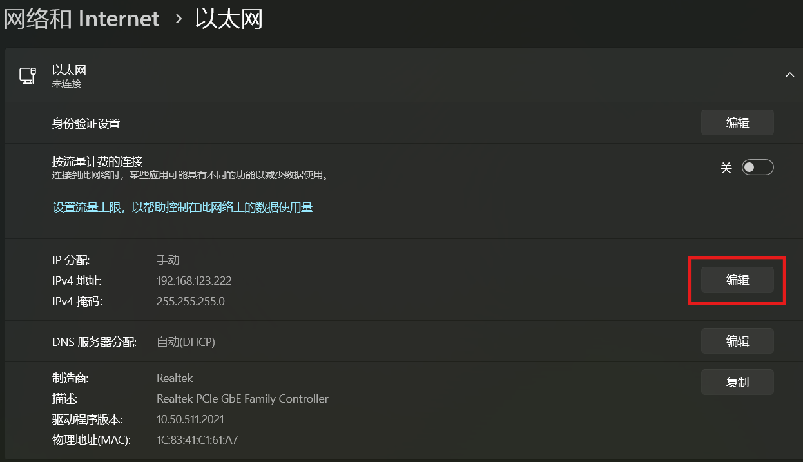

# sim2real
代码参考 [unitreerobotics/unitree_rl_gym](https://github.com/unitreerobotics/unitree_rl_gym)，实现基于 isaaclab 训练的宇树 Go2 强化学习策略模型的实地部署。

> 直接将本项目的部署代码 `deploy/deploy_real/*` 和预训练模型 `deploy/pretrain/*` 复制到机器狗的上位机，不用复制整个 isaaclab 项目。

## 🤖 连接到机器狗
先短按再长按电源键启动机器狗（手柄同理）

### 网线连接
通过网线与其连接，默认网口地址为：`192.168.123.18`，需要将你机器的网口设置在相同网段地址下（比如：`192.168.123.222`），具体操作可以借鉴 [LINK](https://github.com/unitreerobotics/unitree_rl_gym/blob/main/deploy/deploy_real/README.zh.md)，windows 下操作如下：



设置完成后就可以通过默认账号 `unitree` 连接（默认密码为 `123`）：

```bash
ssh unitree@192.168.123.18
```
### WiFi 连接

网线连接物理受限，建议通过 WiFi 连接，比如实验室的 Xiaomi_Go2

首次连接先通过网线连接到机器狗后，设置其连接与本机同一 WiFi ：

```bash
# 看 WiFi 接口设备
sudo iw dev
# 列出可用 WiFi 网络
sudo nmcli dev wifi
# 连接到指定 WiFi
sudo nmcli dev wifi connect WiFi_NAME password xxxx 
```

然后通过 `ifconfig` 查看其 ip 地址就可以通过上述一样的方式连接到机器狗了

## ⚙️ 安装
安装宇树的 SDK （Python 版本）[unitree_sdk2_python](https://github.com/unitreerobotics/unitree_sdk2_python)，创建 Python=3.10 的环境

通过源码安装：

```bash
git clone https://github.com/unitreerobotics/unitree_sdk2_python.git

cd unitree_sdk2_python
pip install -e .
```

或者直接通过 pip 安装：

```bash
pip install unitree_sdk2py
```

基础环境安装：

```bash
pip install torch==2.7.0 torchvision==0.22.0 scipy matplotlib pyyaml
```

## 🎉 运行
在上位机（要运行推理的机器）通过 `ifconfig` 查看与下位机连接的网卡名称，机器狗背部的算力扩展板（Jetson Orin）一般默认为 `eth0` 与下位机连接。

在项目根目录下运行代码，并将上面记录的网卡名称作为第一个参数传递：

```bash
python deploy_go2_flat.py eth0
```

等待连接成功后机器狗趴下进入零力矩模式，根据提示通过手柄控制：
1. 按下 `Start` 机器狗站起，进入默认姿态
2. 按下 `A` 开始运行策略模型
3. 按下 `Select` 退出程序，并重启高层运动控制，恢复到程序启动前的模式（默认为 ai 模式）

如果程序异常退出可以运行 `resume_ai_mode.py` 重启高层运动控制。

配置文件在 `config/*` 目录下，设置 `save_image: True` 查看前置摄像头捕获的图像（每 1s 刷新保存在 [front_camera/front_image.jpg](front_camera/front_image.jpg)）。

sim2real 演示视频如下：

| Velocity | [Navila](https://navila-bot.github.io/) (low level) |
|--- | --- |
|base velocity policy model (flat terrian)|radar obstacle avoidance ([paper](https://navila-bot.github.io/static/navila_paper.pdf))|
|  |  |

## 🔗 相关链接
[unitreerobotics/unitree_rl_gym](https://github.com/unitreerobotics/unitree_rl_gym)

[unitreerobotics/unitree_sdk2_python](https://github.com/unitreerobotics/unitree_sdk2_python)

[Teddy-Liao/walk-these-ways-go2](https://github.com/Teddy-Liao/walk-these-ways-go2)

[fan-ziqi/rl_sar](https://github.com/fan-ziqi/rl_sar)